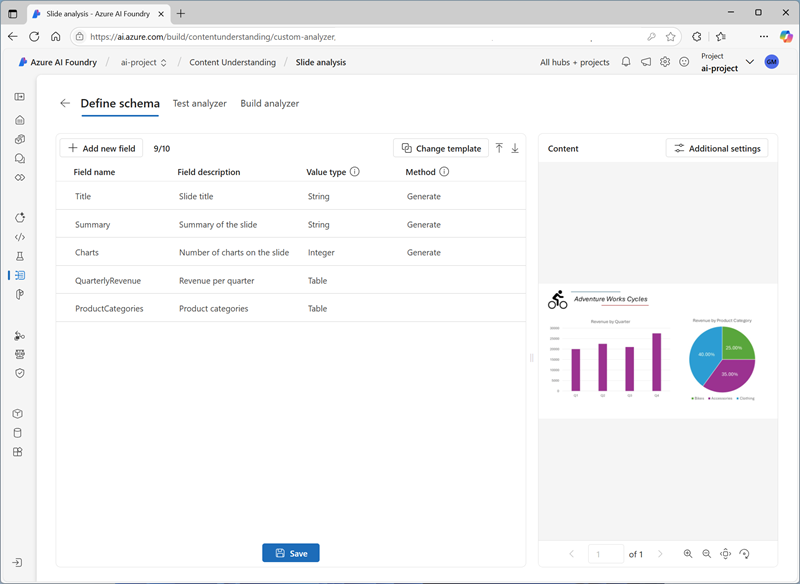
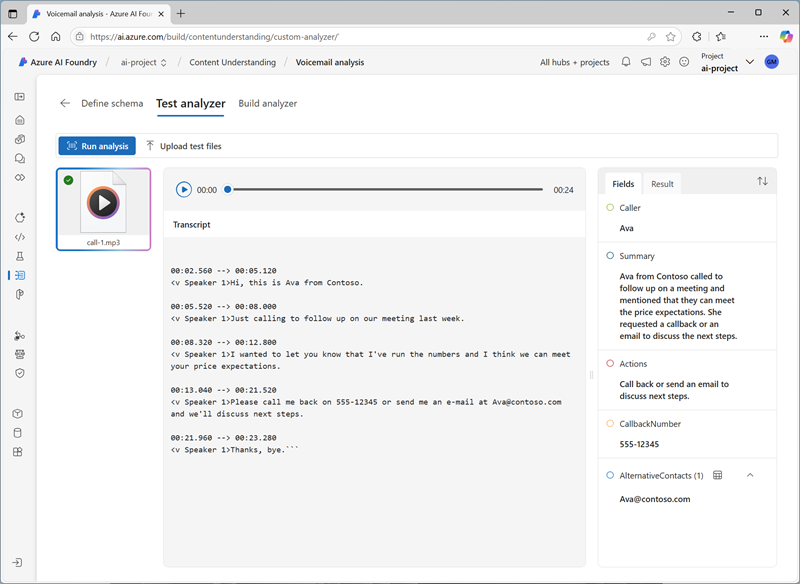

---
lab:
  title: Estrarre informazioni dal contenuto multimodale
  description: 'Usare Comprensione del Contenuto di Azure AI per estrarre informazioni dettagliate da documenti, immagini, registrazioni audio e video.'
---

# Estrarre informazioni dal contenuto multimodale

In questo esercizio si usa Comprensione del Contenuto di Azure per estrarre informazioni da un'ampia gamma di tipi di contenuto, tra cui una fattura, immagini di una diapositiva contenente grafici, una registrazione audio di messaggi vocali e una registrazione video di una conferenza telefonica.

Questo esercizio richiede circa **40** minuti.

## Creare un hub e un progetto Fonderia Azure AI

Le funzionalità di Fonderia Azure AI che verranno usate in questo esercizio richiedono un progetto basato su una risorsa *hub* di Fonderia Azure AI.

1. In un Web browser, aprire il [Portale Fonderia Azure AI](https://ai.azure.com) su `https://ai.azure.com` e accedere usando le credenziali di Azure. Chiudere tutti i riquadri dei suggerimenti o di avvio rapido che vengono aperti al primo accesso e, se necessario, usare il logo **Fonderia Azure AI** in alto a sinistra per passare alla home page, simile all'immagine seguente (chiudere il riquadro **Aiuto** nel caso sia aperto):

    

1. Nel browser passare a `https://ai.azure.com/managementCenter/allResources` e selezionare **Crea nuovo**. Scegliere quindi l'opzione per creare una nuova **risorsa Hub IA**.
1. Nella procedura guidata **Crea un progetto**, immettere un nome valido per il progetto e selezionare l'opzione per crearne uno nuovo. Usare quindi il collegamento **Rinomina hub** per specificare un nome valido per il nuovo hub, espandere **Opzioni avanzate** e specificare le impostazioni seguenti per il progetto:
    - **Sottoscrizione**: *la sottoscrizione di Azure usata*
    - **Gruppo di risorse**: *creare o selezionare un gruppo di risorse*
    - **Area**:  Selezionare una delle posizioni seguenti. *Al momento della stesura di questo articolo, Comprensione del Contenuto di Azure AI è disponibile solo in queste aree*:
        - Australia orientale
        - Svezia centrale
        - Stati Uniti occidentali

    > **Nota**: se si usa una sottoscrizione di Azure in cui i criteri vengono usati per limitare i nomi di risorse consentiti, potrebbe essere necessario usare il collegamento nella parte inferiore della finestra di dialogo **Crea un nuovo progetto** per creare l'hub usando il portale di Azure.

    > **Suggerimento**: se il pulsante **Crea** è ancora disabilitato, assicurarsi di rinominare l'hub in un valore alfanumerico univoco.

1. Attendere la creazione del progetto.

## Scarica il contenuto di 

Il contenuto che si intende analizzare si trova in un archivio ZIP. Scaricarlo ed estrarlo in una cartella locale.

1. In una nuova scheda del browser scaricare [content.zip](https://github.com/microsoftlearning/mslearn-ai-information-extraction/raw/main/Labfiles/content/content.zip) da `https://github.com/microsoftlearning/mslearn-ai-information-extraction/raw/main/Labfiles/content/content.zip` e salvarlo in una cartella locale.
1. Estrarre il file *content.zip* scaricato e visualizzare i file in esso contenuti. Questi file verranno usati per compilare vari analizzatori di Comprensione del Contenuto in questo esercizio.

> **Nota**: Se si è interessati solo a esplorare l'analisi di una modalità specifica (documenti, immagini, video o audio), è possibile passare all'attività pertinente riportata di seguito. Per un'esperienza ottimale, eseguire ogni attività per apprendere come estrarre informazioni da diversi tipi di contenuto.

## Estrarre informazioni dai documenti di fattura

Si creerà un analizzatore di Comprensione del Contenuto di Azure AI in grado di estrarre informazioni dalle fatture. È possibile iniziare definendo uno schema basato su un esempio di fattura.

### Definire uno schema per l'analisi delle fatture

1. Nel riquadro di spostamento a sinistra della scheda del browser contenente la pagina iniziale del progetto Fonderia Azure AI selezionare **Comprensione del Contenuto**.
1. Nella pagina **Comprensione del Contenuto** selezionare la scheda **Attività personalizzata** in alto.
1. Nella pagina Attività personalizzata di Comprensione del Contenuto selezionare **+ Crea** e creare un'attività con le impostazioni seguenti:
    - **Nome attività**: `Invoice analysis`
    - **Descrizione**: `Extract data from an invoice`
    - **Analisi del contenuto di un singolo file**: *Opzione selezionata*
    - **Impostazioni avanzate**:
        - **Connessione a Servizi di Azure AI**: *Risorsa di Servizi di Azure AI nell'hub di Fonderia Azure AI*
        - **Account di archiviazione BLOB di Azure**: *l'account di archiviazione predefinito nell'hub di Fonderia Azure AI*
1. Attendere la creazione dell'attività.

    > **Suggerimento**: se si verifica un errore di accesso alla memoria, attendere un minuto e riprovare. La propagazione delle autorizzazioni per un nuovo hub potrebbe richiedere alcuni minuti.

1. Nella pagina **Definisci schema** caricare il file **invoice-1234.pdf** dalla cartella in cui sono stati estratti i file di contenuto. Questo file contiene la fattura seguente:

    

1. Nella pagina **Definisci schema**, dopo aver caricato il file della fattura, selezionare il modello **Estrazione dati fattura** e selezionare **Crea**.

    Il modello *Analisi delle fatture* include i campi comuni contenuti nelle fatture. È possibile usare l'editor schemi per eliminare i campi suggeriti non necessari e aggiungere quelli personalizzati.

1. Nell'elenco dei campi suggeriti, selezionare **BillingAddress**. Questo campo non è necessario per il formato di fattura caricato, quindi usare l'icona **Elimina campo** (**&#128465;**) visualizzata nella riga del campo selezionato per eliminarlo.
1. Eliminare ora i campi suggeriti seguenti, che non sono necessari per lo schema della fattura:
    - BillingAddressRecipient
    - CustomerAddressRecipient
    - CustomerId
    - CustomerTaxId
    - DueDate
    - InvoiceTotal
    - PaymentTerm
    - PreviousUnpaidBalance
    - PurchaseOrder
    - RemittanceAddress
    - RemittanceAddressRecipient
    - ServiceAddress
    - ServiceAddressRecipient
    - ShippingAddress
    - ShippingAddressRecipient
    - TotalDiscount
    - VendorAddressRecipient
    - VendorTaxId
    - TaxDetails
1. Usare il pulsante **+ Aggiungi nuovo campo** per aggiungere i campi seguenti, selezionando **Salva modifiche** (**&#10003;**) per ogni nuovo campo:

    | Nome del campo | Descrizione campo | Tipo di valore | metodo |
    |--|--|--|--|
    | `VendorPhone` | `Vendor telephone number` | String | Estrazione |
    | `ShippingFee` | `Fee for shipping` | Numero | Estrazione |

1. Nella riga per il campo **Items** si noti che questo campo è una *tabella* (contiene la raccolta di elementi nella fattura). Selezionare la rispettiva icona **Modifica** (&#9638;) per aprire una nuova pagina con i relativi campi secondari.
1. Rimuovere i campi secondari seguenti dalla tabella **Items**:
    - Data
    - ProductCode
    - Unità
    - TaxAmount
    - TaxRate
1. Usare il pulsante **OK** per confermare le modifiche e tornare al livello superiore dello schema della fattura.

1. Verificare che lo schema completato sia simile al seguente e selezionare **Salva**.

    

1. Nella pagina **Test dell'analizzatore**, se l'analisi non inizia automaticamente, selezionare **Esegui analisi**. Attendere quindi il completamento dell'analisi.

1. Esaminare i risultati dell'analisi, che dovrebbero essere simili ai seguenti:

    

1. Visualizzare i dettagli dei campi identificati nel riquadro **Campi**.

### Creare e testare un analizzatore per le fatture

Ora che è stato eseguito il training di un modello per estrarre i campi dalle fatture, è possibile creare un analizzatore da usare con documenti simili.

1. Selezionare la pagina **Elenco analizzatori**, quindi selezionare **+ Crea analizzatore** e creare un nuovo analizzatore con le seguenti proprietà (digitate esattamente come illustrato di seguito):
    - **Nome**: `invoice-analyzer`
    - **Descrizione**: `Invoice analyzer`
1. Attendere che il nuovo analizzatore sia pronto (usare il pulsante **Aggiorna** per controllare).
1. Dopo aver creato l'analizzatore, selezionare il collegamento **invoice-analyzer**. Verranno visualizzati i campi definiti nello schema dell'analizzatore.
1. Nella pagina **invoice-analyzer** selezionare la scheda **Test**.
1. Usare il pulsante **+ Carica file di test** per caricare **invoice-1235.pdf** dalla cartella in cui sono stati estratti i file di contenuto e fare clic su **Esegui analisi** per estrarre i dati dei campi dalla fattura.

    La fattura analizzata ha un aspetto simile al seguente:

    

1. Esaminare il riquadro **Campi** e verificare che l'analizzatore abbia estratto i campi corretti dalla fattura di test.
1. Esaminare il riquadro **Risultati** per visualizzare la risposta JSON restituita dall'analizzatore a un'applicazione client.
1. Nella scheda **Esempio di codice** visualizzare il codice di esempio che è possibile usare per sviluppare un'applicazione client che usa l'interfaccia REST di Comprensione del Contenuto per chiamare l'analizzatore.
1. Chiudere la pagina **invoice-analyzer**.

## Estrarre informazioni da un'immagine di diapositiva

Si creerà un analizzatore di Comprensione del Contenuto di Azure AI in grado di estrarre informazioni da una diapositiva contenente grafici.

### Definire uno schema per l'analisi delle immagini

1. Nel riquadro di spostamento a sinistra della scheda del browser contenente la pagina iniziale del progetto Fonderia Azure AI selezionare **Comprensione del Contenuto**.
1. Nella pagina **Comprensione del Contenuto** selezionare la scheda **Attività personalizzata** in alto.
1. Nella pagina Attività personalizzata di Comprensione del Contenuto selezionare **+ Crea** e creare un'attività con le impostazioni seguenti:
    - **Nome attività**: `Slide analysis`
    - **Descrizione**: `Extract data from an image of a slide`
    - **Analisi del contenuto di un singolo file**: *Opzione selezionata*
    - **Impostazioni avanzate**:
        - **Connessione a Servizi di Azure AI**: *Risorsa di Servizi di Azure AI nell'hub di Fonderia Azure AI*
        - **Account di archiviazione BLOB di Azure**: *l'account di archiviazione predefinito nell'hub di Fonderia Azure AI*
1. Attendere la creazione dell'attività.

    > **Suggerimento**: se si verifica un errore di accesso alla memoria, attendere un minuto e riprovare. La propagazione delle autorizzazioni per un nuovo hub potrebbe richiedere alcuni minuti.

1. Nella pagina **Definisci schema** caricare il file **slide-1.jpg** dalla cartella in cui sono stati estratti i file di contenuto. Selezionare quindi il modello **Analisi delle immagini** e selezionare **Crea**.

    Il modello *Analisi delle immagini* non include campi predefiniti. È necessario definire i campi per descrivere le informazioni da estrarre.

1. Usare il pulsante **+ Aggiungi nuovo campo** per aggiungere i campi seguenti, selezionando **Salva modifiche** (**&#10003;**) per ogni nuovo campo:

    | Nome del campo | Descrizione campo | Tipo di valore | metodo |
    |--|--|--|--|
    | `Title` | `Slide title` | String | Generate |
    | `Summary` | `Summary of the slide` | String | Generate |
    | `Charts` | `Number of charts on the slide` | Intero | Generate |

1. Usare il pulsante **+ Aggiungi nuovo campo** per aggiungere un nuovo campo denominato `QuarterlyRevenue` con la descrizione `Revenue per quarter` e il tipo di valore **tabella**, quindi salvare il nuovo campo (**&#10003;**). Nella nuova pagina per i campi tabella secondari che si aprirà aggiungere quindi i campi secondari seguenti:

    | Nome del campo | Descrizione campo | Tipo di valore | metodo |
    |--|--|--|--|
    | `Quarter` | `Which quarter?` | String | Generate |
    | `Revenue` | `Revenue for the quarter` | Numero | Generate |

1. Selezionare **Indietro** (icona a forma di freccia accanto al pulsante **Aggiungi nuovo campo secondario**) o **&#10003; OK** per tornare al livello superiore dello schema e usare il pulsante **+ Aggiungi nuovo campo** per aggiungere un nuovo campo denominato `ProductCategories` con la descrizione `Product categories` e il tipo di valore **Tabella**, quindi salvare il nuovo campo (**&#10003;**). Nella nuova pagina per i campi tabella secondari che si aprirà aggiungere quindi i campi secondari seguenti:

    | Nome del campo | Descrizione campo | Tipo di valore | metodo |
    |--|--|--|--|
    | `ProductCategory` | `Product category name` | String | Generate |
    | `RevenuePercentage` | `Percentage of revenue` | Numero | Generate |

1. Selezionare **Indietro** (icona a forma di freccia accanto al pulsante **Aggiungi nuovo campo secondario**) o **&#10003; OK** per tornare al livello superiore dello schema e verificare che abbia questo aspetto. Quindi selezionare **Salva**.

    

1. Nella pagina **Test dell'analizzatore**, se l'analisi non inizia automaticamente, selezionare **Esegui analisi**. Attendere quindi il completamento dell'analisi.

    La diapositiva analizzata ha un aspetto simile al seguente:

    

1. Esaminare i risultati dell'analisi, che dovrebbero essere simili ai seguenti:

    

1. Visualizzare i dettagli dei campi identificati nel riquadro **Campi**, espandendo i campi **QuarterlyRevenue** e **ProductCategories** per visualizzare i valori dei campi secondari.

### Creare e testare un analizzatore

Ora che è stato eseguito il training di un modello per estrarre i campi dalle diapositive, è possibile creare un analizzatore da usare con immagini di diapositiva simili.

1. Selezionare la pagina **Elenco analizzatori**, quindi selezionare **+ Crea analizzatore** e creare un nuovo analizzatore con le seguenti proprietà (digitate esattamente come illustrato di seguito):
    - **Nome**: `slide-analyzer`
    - **Descrizione**: `Slide image analyzer`
1. Attendere che il nuovo analizzatore sia pronto (usare il pulsante **Aggiorna** per controllare).
1. Dopo aver creato l'analizzatore, selezionare il collegamento **slide-analyzer**. Verranno visualizzati i campi definiti nello schema dell'analizzatore.
1. Nella pagina **slide-analyzer** selezionare la scheda **Test**.
1. Usare il pulsante **+ Carica file di test** per caricare **slide-2.jpg** dalla cartella in cui sono stati estratti i file di contenuto e fare clic su **Esegui analisi** per estrarre i dati dei campi dall'immagine.

    La diapositiva analizzata ha un aspetto simile al seguente:

    

1. Esaminare il riquadro **Campi** e verificare che l'analizzatore abbia estratto i campi corretti dall'immagine di diapositiva.

    > **Nota**: La diapositiva 2 non include una suddivisione per categoria di prodotto, quindi i dati sui ricavi della categoria di prodotto non vengono trovati.

1. Esaminare il riquadro **Risultati** per visualizzare la risposta JSON restituita dall'analizzatore a un'applicazione client.
1. Nella scheda **Esempio di codice** visualizzare il codice di esempio che è possibile usare per sviluppare un'applicazione client che usa l'interfaccia REST di Comprensione del Contenuto per chiamare l'analizzatore.
1. Chiudere la pagina **slide-analyzer**.

## Estrarre informazioni da una registrazione audio della segreteria telefonica

Si creerà un analizzatore di Comprensione del Contenuto di Azure AI in grado di estrarre informazioni da una registrazione audio di un messaggio della segreteria telefonica.

### Definire uno schema per l'analisi audio

1. Nel riquadro di spostamento a sinistra della scheda del browser contenente la pagina iniziale del progetto Fonderia Azure AI selezionare **Comprensione del Contenuto**.
1. Nella pagina **Comprensione del Contenuto** selezionare la scheda **Attività personalizzata** in alto.
1. Nella pagina Attività personalizzata di Comprensione del Contenuto selezionare **+ Crea** e creare un'attività con le impostazioni seguenti:
    - **Nome attività**: `Voicemail analysis`
    - **Descrizione**: `Extract data from a voicemail recording`
    - **Analisi del contenuto di un singolo file**: *Opzione selezionata*
    - **Impostazioni avanzate**:
        - **Connessione a Servizi di Azure AI**: *Risorsa di Servizi di Azure AI nell'hub di Fonderia Azure AI*
        - **Account di archiviazione BLOB di Azure**: *l'account di archiviazione predefinito nell'hub di Fonderia Azure AI*
1. Attendere la creazione dell'attività.

    > **Suggerimento**: se si verifica un errore di accesso alla memoria, attendere un minuto e riprovare. La propagazione delle autorizzazioni per un nuovo hub potrebbe richiedere alcuni minuti.

1. Nella pagina **Definisci schema** caricare il file **call-1.mp3** dalla cartella in cui sono stati estratti i file di contenuto. Selezionare quindi il modello di **Analisi trascrizione parlato** e selezionare **Crea**.
1. Nel riquadro **Contenuto** a destra selezionare **Ottieni anteprima trascrizione** per visualizzare una trascrizione del messaggio registrato.

    Il modello *Analisi trascrizione parlato* non include campi predefiniti. È necessario definire i campi per descrivere le informazioni da estrarre.

1. Usare il pulsante **+ Aggiungi nuovo campo** per aggiungere i campi seguenti, selezionando **Salva modifiche** (**&#10003;**) per ogni nuovo campo:

    | Nome del campo | Descrizione campo | Tipo di valore | metodo |
    |--|--|--|--|
    | `Caller` | `Person who left the message` | String | Generate |
    | `Summary` | `Summary of the message` | String | Generate |
    | `Actions` | `Requested actions` | String | Generate |
    | `CallbackNumber` | `Telephone number to return the call` | String | Generate |
    | `AlternativeContacts` | `Alternative contact details` | Elenco delle stringhe | Generate |

1. Verificare che lo schema sia simile al seguente. Quindi selezionare **Salva**.

    

1. Nella pagina **Test dell'analizzatore**, se l'analisi non inizia automaticamente, selezionare **Esegui analisi**. Attendere quindi il completamento dell'analisi.

    L'analisi audio può richiedere del tempo. Durante l'attesa, è possibile riprodurre il file audio seguente:

    <video controls src="https://github.com/MicrosoftLearning/mslearn-ai-information-extraction/raw/refs/heads/main/Instructions/Labs/media/call-1.mp4" title="Chiamata 1" width="300">
        <track src="https://github.com/MicrosoftLearning/mslearn-ai-information-extraction/raw/refs/heads/main/Instructions/Labs/media/call-1.vtt" kind="captions" srclang="en" label="English">
    </video>

    **Nota**: Questo audio è stato generato con l'intelligenza artificiale.

1. Esaminare i risultati dell'analisi, che dovrebbero essere simili ai seguenti:

    

1. Visualizzare i dettagli dei campi identificati nel riquadro **Campi**, espandendo il campo **AlternativeContacts** per visualizzare i valori elencati.

### Creare e testare un analizzatore

Ora che è stato eseguito il training di un modello per estrarre i campi dai messaggi vocali, è possibile creare un analizzatore da usare con registrazioni audio simili.

1. Selezionare la pagina **Elenco analizzatori**, quindi selezionare **+ Crea analizzatore** e creare un nuovo analizzatore con le seguenti proprietà (digitate esattamente come illustrato di seguito):
    - **Nome**: `voicemail-analyzer`
    - **Descrizione**: `Voicemail audio analyzer`
1. Attendere che il nuovo analizzatore sia pronto (usare il pulsante **Aggiorna** per controllare).
1. Dopo aver creato l'analizzatore, selezionare il collegamento **voicemail-analyzer**. Verranno visualizzati i campi definiti nello schema dell'analizzatore.
1. Nella pagina **voicemail-analyzer** selezionare la scheda **Test**.
1. Usare il pulsante **+ Carica file di test** per caricare **call-2.mp3** dalla cartella in cui sono stati estratti i file di contenuto e fare clic su **Esegui analisi** per estrarre i dati dei campi dal file audio.

    L'analisi audio può richiedere del tempo. Durante l'attesa, è possibile riprodurre il file audio seguente:

    <video controls src="https://github.com/MicrosoftLearning/mslearn-ai-information-extraction/raw/refs/heads/main/Instructions/Labs/media/call-2.mp4" title="Chiamata 2" width="300">
        <track src="https://github.com/MicrosoftLearning/mslearn-ai-information-extraction/raw/refs/heads/main/Instructions/Labs/media/call-2.vtt" kind="captions" srclang="en" label="English">
    </video>

    **Nota**: Questo audio è stato generato con l'intelligenza artificiale.

1. Esaminare il riquadro **Campi** e verificare che l'analizzatore abbia estratto i campi corretti dal messaggio vocale.
1. Esaminare il riquadro **Risultati** per visualizzare la risposta JSON restituita dall'analizzatore a un'applicazione client.
1. Nella scheda **Esempio di codice** visualizzare il codice di esempio che è possibile usare per sviluppare un'applicazione client che usa l'interfaccia REST di Comprensione del Contenuto per chiamare l'analizzatore.
1. Chiudere la pagina **voicemail-analyzer**.

## Estrarre informazioni da una registrazione di conferenza video

Si creerà un analizzatore di Comprensione del Contenuto di Azure AI in grado di estrarre informazioni da una registrazione video di una conferenza telefonica.

### Definire uno schema per l'analisi video

1. Nel riquadro di spostamento a sinistra della scheda del browser contenente la pagina iniziale del progetto Fonderia Azure AI selezionare **Comprensione del Contenuto**.
1. Nella pagina **Comprensione del Contenuto** selezionare la scheda **Attività personalizzata** in alto.
1. Nella pagina Attività personalizzata di Comprensione del Contenuto selezionare **+ Crea** e creare un'attività con le impostazioni seguenti:
    - **Nome attività**: `Conference call video analysis`
    - **Descrizione**: `Extract data from a video conference recording`
    - **Analisi del contenuto di un singolo file**: *Opzione selezionata*
    - **Impostazioni avanzate**:
        - **Connessione a Servizi di Azure AI**: *Risorsa di Servizi di Azure AI nell'hub di Fonderia Azure AI*
        - **Account di archiviazione BLOB di Azure**: *l'account di archiviazione predefinito nell'hub di Fonderia Azure AI*
1. Attendere la creazione dell'attività.

    > **Suggerimento**: se si verifica un errore di accesso alla memoria, attendere un minuto e riprovare. La propagazione delle autorizzazioni per un nuovo hub potrebbe richiedere alcuni minuti.

1. Nella pagina **Definisci schema** caricare il file **meeting-1.mp4** dalla cartella in cui sono stati estratti i file di contenuto. Selezionare quindi il modello **Analisi video** e selezionare **Crea**.
1. Nel riquadro **Contenuto** a destra selezionare **Ottieni anteprima trascrizione** per visualizzare una trascrizione del messaggio registrato.

    Il modello *Analisi video* estrae i dati per il video. Non include campi predefiniti. È necessario definire i campi per descrivere le informazioni da estrarre.

1. Usare il pulsante **+ Aggiungi nuovo campo** per aggiungere i campi seguenti, selezionando **Salva modifiche** (**&#10003;**) per ogni nuovo campo:

    | Nome del campo | Descrizione campo | Tipo di valore | metodo |
    |--|--|--|--|
    | `Summary` | `Summary of the discussion` | String | Generate |
    | `Participants` | `Count of meeting participants` | Intero | Generate |
    | `ParticipantNames` | `Names of meeting participants` | Elenco delle stringhe | Generate |
    | `SharedSlides` | `Descriptions of any PowerPoint slides presented` | Elenco delle stringhe | Generate |
    | `AssignedActions` | `Tasks assigned to participants` | Tabella |  |

1. Quando si immette il campo **AssignedActions**, creare i campi secondari seguenti nella tabella di campi secondari visualizzata:

    | Nome del campo | Descrizione campo | Tipo di valore | metodo |
    |--|--|--|--|
    | `Task` | `Description of the task` | String | Generate |
    | `AssignedTo` | `Who the task is assigned to` | String | Generate |

1. Selezionare **Indietro** (icona a forma di freccia accanto al pulsante **Aggiungi nuovo campo secondario**) o **&#10003; OK** per tornare al livello superiore dello schema e verificare che abbia questo aspetto. Quindi selezionare **Salva**.

1. Verificare che lo schema sia simile al seguente. Quindi selezionare **Salva**.

    

1. Nella pagina **Test dell'analizzatore**, se l'analisi non inizia automaticamente, selezionare **Esegui analisi**. Attendere quindi il completamento dell'analisi.

    L'analisi video può richiedere del tempo. Durante l'attesa, è possibile visualizzare il video seguente:

    <video controls src="https://github.com/MicrosoftLearning/mslearn-ai-information-extraction/raw/refs/heads/main/Instructions/Labs/media/meeting-1.mp4" title="Riunione 1" width="480">
        <track src="https://github.com/MicrosoftLearning/mslearn-ai-information-extraction/raw/refs/heads/main/Instructions/Labs/media/meeting-1.vtt" kind="captions" srclang="en" label="English">
    </video>

    **Nota**: Questo video è stato generato con l'intelligenza artificiale.

1. Al termine dell'analisi, esaminare i risultati, che dovrebbero essere simili ai seguenti:

    

1. Nel riquadro **Campi** visualizzare i dati estratti per il video, inclusi i campi aggiunti. Visualizzare i valori dei campi generati, espandendo i campi elenco e tabella in base alle esigenze.

### Creare e testare un analizzatore

Ora che è stato eseguito il training di un modello per estrarre i campi dalle registrazioni di una conferenza telefonica, è possibile creare un analizzatore da usare con video simili.

1. Selezionare la pagina **Elenco analizzatori**, quindi selezionare **+ Crea analizzatore** e creare un nuovo analizzatore con le seguenti proprietà (digitate esattamente come illustrato di seguito):
    - **Nome**: `conference-call-analyzer`
    - **Descrizione**: `Conference call video analyzer`
1. Attendere che il nuovo analizzatore sia pronto (usare il pulsante **Aggiorna** per controllare).
1. Dopo aver creato l'analizzatore, selezionare il collegamento **conference-call-analyzer**. Verranno visualizzati i campi definiti nello schema dell'analizzatore.
1. Nella pagina **conference-call-analyzer** selezionare la scheda **Test**.
1. Usare il pulsante **Carica file di test** per caricare **meeting-2.mp4** dalla cartella in cui sono stati estratti i file di contenuto ed eseguire l'analisi per estrarre i dati dei campi dal file audio.

    L'analisi video può richiedere del tempo. Durante l'attesa, è possibile visualizzare il video seguente:

    <video controls src="https://github.com/MicrosoftLearning/mslearn-ai-information-extraction/raw/refs/heads/main/Instructions/Labs/media/meeting-2.mp4" title="Riunione 2" width="480">
        <track src="https://github.com/MicrosoftLearning/mslearn-ai-information-extraction/raw/refs/heads/main/Instructions/Labs/media/meeting-2.vtt" kind="captions" srclang="en" label="English">
    </video>

    **Nota**: Questo video è stato generato con l'intelligenza artificiale.

1. Esaminare il riquadro **Campi** e visualizzare i campi estratti dall'analizzatore per il video della conferenza telefonica.
1. Esaminare il riquadro **Risultati** per visualizzare la risposta JSON restituita dall'analizzatore a un'applicazione client.
1. Chiudere la pagina **conference-call-analyzer**.

## Eseguire la pulizia

Al termine del lavoro con il servizio di comprensione dei contenuti, è necessario eliminare le risorse create in questo esercizio per evitare di incorrere in costi di Azure non necessari.

1. Nel Portale Fonderia Azure AI passare all'hub e nella pagina di panoramica selezionare il progetto ed eliminarlo.
1. Nel portale di Azure eliminare il gruppo di risorse creato in questi esercizi.
