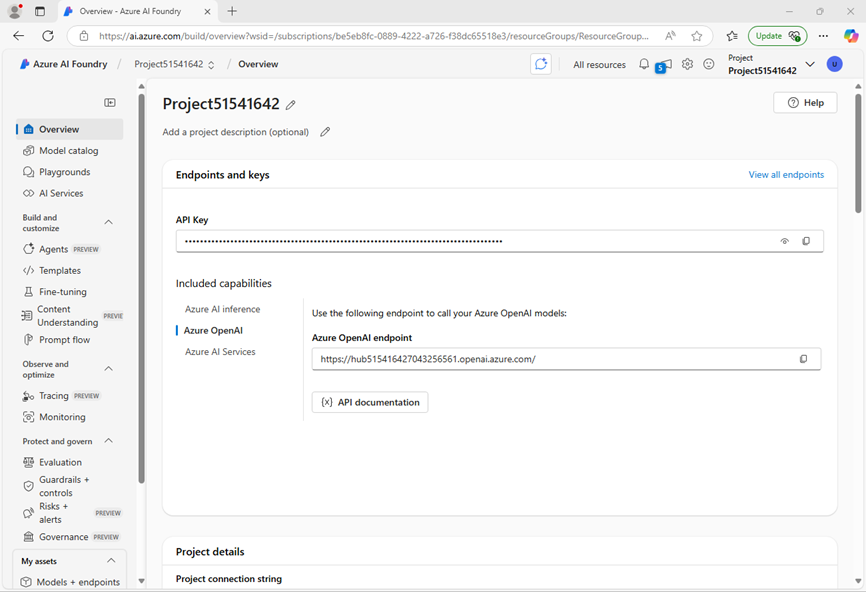
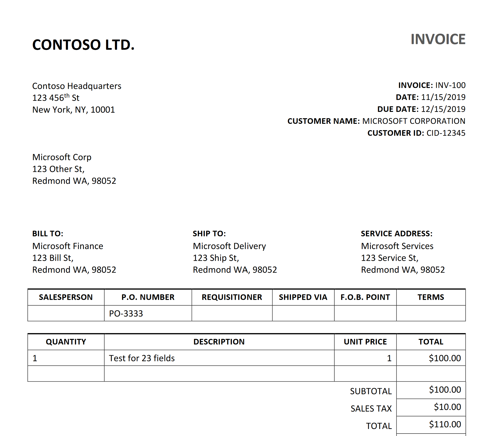

---
lab:
  title: Analizzare moduli con modelli predefiniti di Informazioni sui documenti di Azure AI
  description: Usare i modelli di Informazioni sui documenti di Azure AI predefiniti per elaborare i campi di testo dai documenti.
---

# Analizzare moduli con modelli predefiniti di Informazioni sui documenti di Azure AI

In questo esercizio si configurerà un progetto di Fonderia Azure AI con tutte le risorse necessarie per l'analisi dei documenti. Si useranno sia il Portale Fonderia Azure AI che Python SDK per inviare moduli a tale risorsa per l'analisi.

Anche se questo esercizio è basato su Python, è possibile sviluppare applicazioni simili usando più SDK specifici del linguaggio, tra cui:

- [Libreria client di Informazioni sui documenti di Azure AI per Python](https://pypi.org/project/azure-ai-formrecognizer/)
- [Libreria client di Informazioni sui documenti di Azure AI per Microsoft .NET](https://www.nuget.org/packages/Azure.AI.FormRecognizer)
- [Libreria client di Informazioni sui documenti di Azure AI per JavaScript](https://www.npmjs.com/package/@azure/ai-form-recognizer)

Questo esercizio richiede circa **30** minuti.

## Creare un progetto Fonderia Azure AI

Per iniziare, creare un progetto Fonderia Azure AI.

1. In un Web browser, aprire il [Portale Fonderia Azure AI](https://ai.azure.com) su `https://ai.azure.com` e accedere usando le credenziali di Azure. Chiudere tutti i riquadri dei suggerimenti o di avvio rapido che vengono aperti al primo accesso e, se necessario, usare il logo **Fonderia Azure AI** in alto a sinistra per passare alla home page, simile all'immagine seguente (chiudere il riquadro **Aiuto** nel caso sia aperto):

    

1. Nel browser passare a `https://ai.azure.com/managementCenter/allResources` e selezionare **Crea nuovo**. Scegliere quindi l'opzione per creare una nuova **risorsa Hub IA**.
1. Nella procedura guidata **Crea un progetto**, immettere un nome valido per il progetto e selezionare l'opzione per crearne uno nuovo. Usare quindi il collegamento **Rinomina hub** per specificare un nome valido per il nuovo hub, espandere **Opzioni avanzate** e specificare le impostazioni seguenti per il progetto:
    - **Sottoscrizione**: *la sottoscrizione di Azure usata*
    - **Gruppo di risorse**: *creare o selezionare un gruppo di risorse*
    - **Area**:  *Qualsiasi area disponibile*

    > **Nota**: se si usa una sottoscrizione di Azure in cui i criteri vengono usati per limitare i nomi di risorse consentiti, potrebbe essere necessario usare il collegamento nella parte inferiore della finestra di dialogo **Crea un nuovo progetto** per creare l'hub usando il portale di Azure.

    > **Suggerimento**: se il pulsante **Crea** è ancora disabilitato, assicurarsi di rinominare l'hub in un valore alfanumerico univoco.

1. Attendere la creazione del progetto.
1. Quando viene creato il progetto, chiudere tutti i suggerimenti visualizzati e rivedere la pagina del progetto nel portale Fonderia di Azure AI, che dovrebbe essere simile all'immagine seguente:

    

## Usare il modello Lettura

Per iniziare, usare il portale di **Fonderia Azure AI** e il modello di lettura per analizzare un documento in più lingue:

1. Nel pannello di spostamento a sinistra selezionare **Servizi IA**.
1. Nella pagina **Servizi di Azure AI** selezionare il riquadro **Visione e documento**.
1. Nella pagina **Visione e documento** verificare che la scheda **Documento** sia selezionata, quindi selezionare il riquadro **OCR/Lettura**.

    Nella pagina **Lettura** la risorsa di Servizi di Azure AI creata con il progetto dovrebbe essere già connessa.

1. Nell'elenco dei documenti a sinistra, selezionare **read-german.pdf**.

    

1. Nella barra degli strumenti in alto selezionare **Opzioni di analisi**, quindi abilitare la casella di controllo **Lingua** (in **Rilevamento facoltativo**) nel riquadro **Opzioni di analisi** e selezionare **Salva**. 
1. In alto a sinistra, selezionare **Esegui analisi**.
1. Al termine dell'analisi, il testo estratto dall'immagine viene visualizzato a destra nella scheda **Content**. Esaminare questo testo e confrontarlo con il testo nell'immagine originale per valutarne l'accuratezza.
1. Selezionare la scheda **Result**. Questa scheda visualizza il codice JSON estratto. 

## Preparare lo sviluppo di un'app in Cloud Shell

Ora verrà esaminata l'app che usa l’SDK del servizio Azure Document Intelligence. L'app verrà sviluppata usando Cloud Shell. I file di codice per l'app sono stati forniti in un repository GitHub.

Questa è la fattura che verrà analizzata dal codice.



1. Nel Portale Fonderia Azure AI visualizzare la pagina **Panoramica** per il progetto.
1. Nell'area **Endpoint e chiavi** selezionare la scheda **Servizi di Azure AI** e prendere nota della **Chiave API** e dell'**Endpoint di Servizi di Azure AI**. Queste credenziali verranno usate per connettersi ai Servizi di Azure AI in un'applicazione client.
1. Aprire una nuova scheda del browser (mantenendo aperto il Portale Fonderia Azure AI nella scheda esistente). In una nuova scheda del browser, passare al [portale di Azure](https://portal.azure.com) su `https://portal.azure.com`, accedendo con le credenziali di Azure se richiesto.
1. Usare il pulsante **[\>_]** a destra della barra di ricerca, nella parte superiore della pagina, per aprire una nuova sessione di Cloud Shell nel portale di Azure selezionando un ambiente ***PowerShell***. Cloud Shell fornisce un'interfaccia della riga di comando in un riquadro nella parte inferiore del portale di Azure.

    > **Nota**: se in precedenza è stata creata una sessione Cloud Shell che usa un ambiente *Bash*, passare a ***PowerShell***.

1. Nella barra degli strumenti di Cloud Shell scegliere **Vai alla versione classica** dal menu **Impostazioni**. Questa operazione è necessaria per usare l'editor di codice.

    **<font color="red">Verificare di passare alla versione classica di Cloud Shell prima di continuare.</font>**

1. Nel riquadro PowerShell immettere i comandi seguenti per clonare il repository GitHub per questo esercizio:

    ```
   rm -r mslearn-ai-info -f
   git clone https://github.com/microsoftlearning/mslearn-ai-information-extraction mslearn-ai-info
    ```

    > **Suggerimento**: quando si incollano i comandi in CloudShell, l'ouput può richiedere una grande quantità di buffer dello schermo. È possibile cancellare la schermata immettendo il `cls` comando per rendere più semplice concentrarsi su ogni attività.

    ***Ora seguire i passaggi per il linguaggio di programmazione scelto.***

1. Dopo aver clonato il repository, passare alla cartella contenente i file di codice:

    ```
   cd mslearn-ai-info/Labfiles/prebuilt-doc-intelligence/Python
    ```

1. Nel riquadro della riga di comando di Cloud Shell immettere il comando seguente per installare le librerie che si useranno, ovvero:

    ```
   python -m venv labenv
   ./labenv/bin/Activate.ps1
   pip install -r requirements.txt azure-ai-formrecognizer==3.3.3
    ```

1. Immettere il comando seguente per modificare il file di configurazione fornito:

    ```
   code .env
    ```

    Il file viene aperto in un editor di codice.

1. Nel file di codice sostituire i segnaposto **YOUR_ENDPOINT** e **YOUR_KEY** con l'endpoint dei Servizi di Azure AI e la relativa chiave API, copiati dal Portale Fonderia Azure AI.
1. Dopo aver sostituito i segnaposto, nell'editor di codice, usare il comando **CTRL+S** per salvare le modifiche e quindi usare il comando **CTRL+Q** per chiudere l'editor di codice mantenendo aperta la riga di comando di Cloud Shell.

## Aggiungere il codice per usare il servizio Azure Document Intelligence

A questo punto, è possibile usare l'SDK per valutare il file pdf.

1. Immettere il comando seguente per modificare il file di app fornito:

    ```
   code document-analysis.py
    ```

    Il file viene aperto in un editor di codice.

1. Nel file di codice trovare il commento **Import the required libraries** e aggiungere il codice seguente:

    ```python
   # Add references
   from azure.core.credentials import AzureKeyCredential
   from azure.ai.formrecognizer import DocumentAnalysisClient
    ```

1. Trovare il commento **Create the client** e aggiungere il codice seguente (prestando attenzione a mantenere il livello di rientro corretto):

    ```python
   # Create the client
   document_analysis_client = DocumentAnalysisClient(
        endpoint=endpoint, credential=AzureKeyCredential(key)
   )
    ```

1. Trovare il commento **Analyze the invoice** e aggiungere il codice seguente:

    ```python
   # Analyse the invoice
   poller = document_analysis_client.begin_analyze_document_from_url(
        fileModelId, fileUri, locale=fileLocale
   )
    ```

1. Trovare il commento **Display invoice information to the user** e aggiungere il codice seguente:

    ```python
   # Display invoice information to the user
   receipts = poller.result()
    
   for idx, receipt in enumerate(receipts.documents):
    
        vendor_name = receipt.fields.get("VendorName")
        if vendor_name:
            print(f"\nVendor Name: {vendor_name.value}, with confidence {vendor_name.confidence}.")

        customer_name = receipt.fields.get("CustomerName")
        if customer_name:
            print(f"Customer Name: '{customer_name.value}, with confidence {customer_name.confidence}.")


        invoice_total = receipt.fields.get("InvoiceTotal")
        if invoice_total:
            print(f"Invoice Total: '{invoice_total.value.symbol}{invoice_total.value.amount}, with confidence {invoice_total.confidence}.")
    ```

1. Nell'editor di codice usare il comando **CTRL+S** o **fare clic con il pulsante destro del mouse > Salva** per salvare le modifiche. Mantenere aperto l'editor di codice nel caso in cui sia necessario correggere eventuali errori nel codice, ma ridimensionare i riquadri in modo da visualizzare chiaramente il riquadro della riga di comando.

1. Nel riquadro della riga di comando immettere il comando seguente per eseguire l'applicazione.

    ```
    python document-analysis.py
    ```

Il programma visualizza il nome del fornitore, il nome del cliente e il totale della fattura con i livelli di confidenza. Confrontare i valori restituiti con la fattura di esempio aperta all'inizio di questa sezione.

## Eseguire la pulizia

Se la risorsa di Azure non è più necessaria, ricordarsi di eliminarla nel [portale di Azure](https://portal.azure.com) (`https://portal.azure.com`) per evitare ulteriori addebiti.
