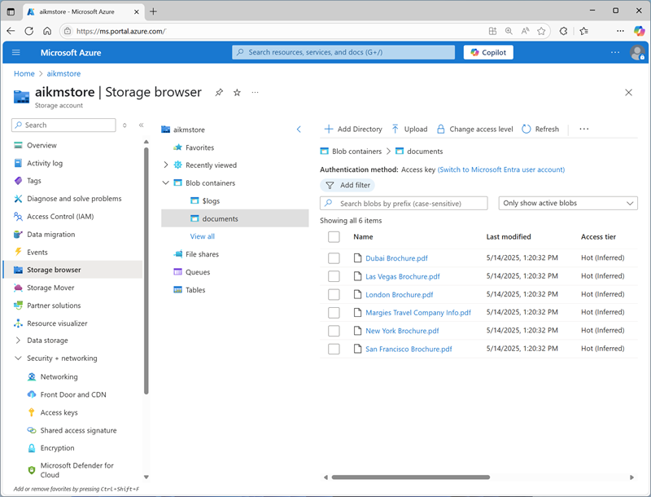

---
lab:
  title: Creazione di una soluzione di knowledge mining
  description: Usare Azure AI Search per estrarre informazioni chiave dai documenti e semplificare la ricerca e l'analisi.
---

# Creazione di una soluzione di knowledge mining

In questo esercizio si usa AI Search per indicizzare un set di documenti gestiti da Margie's Travel, un'agenzia di viaggi fittizia. Il processo di indicizzazione prevede l'uso delle competenze AI per estrarre le informazioni chiave in modo da renderle ricercabili e generare un archivio conoscenze contenente asset di dati per un'ulteriore analisi.

Anche se questo esercizio è basato su Python, è possibile sviluppare applicazioni simili usando più SDK specifici del linguaggio, tra cui:

- [Libreria client di Azure AI Search per Python](https://pypi.org/project/azure-search-documents/)
- [Libreria client di Azure AI Search per Microsoft .NET](https://www.nuget.org/packages/Azure.Search.Documents)
- [Libreria client di Azure AI Search per JavaScript](https://www.npmjs.com/package/@azure/search-documents)

Questo esercizio richiede circa **40** minuti.

## Creare le risorse di Azure

La soluzione che verrà creata per Margie's Travel richiede più risorse nella sottoscrizione di Azure. In questo esercizio verranno create direttamente nel portale di Azure. È anche possibile crearle usando uno script o un modello ARM o BICEP oppure è possibile creare un progetto di Fonderia Azure AI che include una risorsa di ricerca di Azure AI Search.

> **Importante**: Le risorse di Azure devono essere create nella stessa località.

### Creare una risorsa di Azure AI Search

1. In un web browser aprire il [portale di Azure](https://portal.azure.com) in `https://portal.azure.com` e accedere usando le credenziali di Azure.
1. Selezionare il pulsante **&#65291;Crea una risorsa**, cercare `Azure AI Search` e creare una risorsa di **Azure AI Search** con le impostazioni seguenti:
    - **Sottoscrizione**: *la sottoscrizione di Azure usata*
    - **Gruppo di risorse**: *creare o selezionare un gruppo di risorse*
    - **Nome servizio**: *Un nome valido per la risorsa di ricerca*
    - **Località**: *Qualsiasi posizione disponibile*
    - **Piano tariffario**: Gratuito

1. Attendere il completamento della distribuzione e quindi passare alla risorsa distribuita.
1. Esaminare la pagina **Panoramica** nel pannello della risorsa di Azure AI Search nel portale di Azure. In questo caso è possibile usare un'interfaccia visiva per creare, testare, gestire e monitorare i vari componenti di una soluzione di ricerca, incluse origini dati, indici, indicizzatori e set di competenze.

### Creare un account di archiviazione

1. Tornare alla home page e quindi creare una risorsa di tipo **Account di archiviazione** con le impostazioni seguenti:
    - **Sottoscrizione**: *la sottoscrizione di Azure usata*
    - **Gruppo di risorse**: *Lo stesso gruppo di risorse delle risorse di Azure AI Search e dei Servizi di Azure AI*
    - **Nome account di archiviazione**: *Un nome valido per la risorsa di archiviazione*
    - **Area**: *la stessa area della risorsa di Azure AI Search*
    - **Servizio primario**: Archiviazione BLOB di Azure o Azure Data Lake Storage Gen 2
    - **Prestazioni**: standard
    - **Ridondanza**: Archiviazione con ridondanza locale

1. Attendere il completamento della distribuzione e quindi passare alla risorsa distribuita.

    > **Suggerimento**: Mantenere aperta la pagina del portale dell'account di archiviazione. Verrà usata nella procedura successiva.

## Caricare documenti in Archiviazione di Azure

La soluzione di knowledge mining estrarrà informazioni dai documenti di brochure di viaggio in un contenitore BLOB di Archiviazione di Azure.

1. In una nuova scheda del browser scaricare [documents.zip](https://github.com/microsoftlearning/mslearn-ai-information-extraction/raw/main/Labfiles/knowledge/documents.zip) da `https://github.com/microsoftlearning/mslearn-ai-information-extraction/raw/main/Labfiles/knowledge/documents.zip` e salvarlo in una cartella locale.
1. Estrarre il file *documents.zip* scaricato e visualizzare i file di brochure di viaggio in esso contenuti. Le informazioni di questi file verranno estratte e indicizzate.
1. Nella scheda del browser contenente la pagina del portale di Azure per l'account di archiviazione selezionare **Browser archiviazione** nel riquadro di spostamento a sinistra.
1. Nel browser archiviazione selezionare **Contenitori BLOB**.

    L'account di archiviazione dovrebbe attualmente contenere solo il contenitore **$logs** predefinito.

1. Nella barra degli strumenti selezionare **+ Contenitore** e creare un nuovo contenitore con le impostazioni seguenti:
    - **Nome**: `documents`
    - **Livello di accesso anonimo**: Privato (nessun accesso anonimo)\*

    > **Nota**: \*A meno che non sia stata abilitata l'opzione per consentire l'accesso anonimo al contenitore durante la creazione dell'account di archiviazione, non sarà possibile selezionare altre impostazioni.

1. Selezionare il contenitore **documents** per aprirlo e quindi usare il pulsante **Carica** della barra degli strumenti per caricare i file PDF estratti in precedenza da **documents.zip** nella radice del contenitore, come illustrato di seguito:

    

## Creare ed eseguire un indicizzatore

Dopo aver creato i documenti, è possibile creare un indicizzatore per estrarre informazioni da tali documenti.

1. Nel portale di Azure passare alla risorsa di Azure AI Search. Quindi, nella pagina **Panoramica** selezionare **Importa dati**.

    
    
    > **Nota:** Nella pagina **Panoramica** della risorsa di Azure AI Search la barra degli strumenti offre due opzioni:  
    > - **Importa dati** (esperienza classica)  
    > - **Importa dati (nuovo)** (nuova esperienza)  
    >  
    > Il pannello **Introduzione** sotto la sezione Panoramica include inoltre un pulsante **Importa** che reindirizza alla **nuova interfaccia utente**.  
    >  
    > Le istruzioni contenute in questo corso fanno riferimento al **flusso di lavoro di importazione dei dati classico**. Per evitare confusione, assicurarsi di selezionare **Importa dati** dalla barra degli strumenti.
1. Nella pagina **Definisci la connessione ai dati** selezionare **Archiviazione BLOB di Azure** nell'elenco **Origine dati**. Completare quindi i dettagli dell'archivio dati con i valori seguenti:
    - **Origine dati**: Archiviazione BLOB di Azure
    - **Nome origine dati**: `margies-documents`
    - **Dati da estrarre**: contenuto e metadati
    - **Modalità di analisi**: impostazione predefinita
    - **Sottoscrizione**: *la sottoscrizione di Azure usata*
    - **Stringa di connessione:** 
        - Selezionare **Scegliere una connessione esistente**
        - Selezionare l'account di archiviazione
        - Selezionare il contenitore **documents**
    - **Autenticazione identità gestita**: Nessuna
    - **Nome contenitore**: documents
    - **Cartella BLOB**: *lasciare vuoto questo campo*
    - **Descrizione**: `Travel brochures`
1. Procedere al passaggio successivo (**Aggiungere competenze cognitive**), che include tre sezioni espandibili da completare.
1. Nella sezione **Collega Servizi di Azure AI** selezionare **Gratuito (arricchimenti limitati**)\*.

    > **Nota**: \*La risorsa di Servizi di Azure AI gratuita per Azure AI Search può essere usata per indicizzare al massimo 20 documenti. In una soluzione reale è necessario creare una risorsa di Servizi di Azure AI nella sottoscrizione per abilitare l'arricchimento tramite intelligenza artificiale per un numero maggiore di documenti.

1. Nella sezione **Aggiungi arricchimenti**:
    - Modificare il **Nome set di competenze** in `margies-skillset`.
    - Selezionare l'opzione **Abilita OCR e unisci tutto il testo nel campo merged_content**.
    - Assicurarsi che il **Campo dei dati di origine** sia impostato su **merged_content**.
    - Lasciare il campo **Livello di granularità dell'arricchimento** come **Campo di origine**, che imposta l'intero contenuto del documento da indicizzare. Tuttavia, si noti che è possibile modificare questa impostazione per estrarre informazioni a livelli più granulari, ad esempio pagine o frasi.
    - Selezionare i campi arricchiti seguenti:

        | Competenza cognitiva | Parametro | Nome del campo |
        | --------------- | ---------- | ---------- |
        | **Competenze cognitive testo** | |  |
        | Estrai nomi di persone | | persone |
        | Estrai nomi di località | | locations |
        | Estrarre le espressioni chiave | | keyphrase |
        | **Competenze cognitive immagini** | |  |
        | Genera tag dalle immagini | | imageTags |
        | Genera sottotitoli in altre lingue dalle immagini | | imageCaption |

        Controllare le selezioni, perché può essere difficile modificarle in un secondo momento.

1. Nella sezione **Salva arricchimenti in un archivio conoscenze**:
    - Selezionare solo le caselle di controllo seguenti (verrà visualizzato un <font color="red">errore</font>, che verrà risolto a breve):
        - **Proiezioni di file di Azure**:
            - Proiezioni immagini
        - **Proiezioni di tabelle di Azure**:
            - Documenti
                - Frasi chiave
        - **Proiezioni BLOB di Azure**:
            - Document
    - In **Stringa di connessione dell'account di archiviazione** (sotto i <font color="red">messaggi di errore</font>):
        - Selezionare **Scegliere una connessione esistente**
        - Selezionare l'account di archiviazione
        - Selezionare il contenitore **documents**. *Questa operazione è necessaria solo per selezionare l'account di archiviazione nell'interfaccia di esplorazione. Si specificherà un nome contenitore diverso per gli asset di conoscenza estratti*.
    - Modificare il **Nome contenitore** in `knowledge-store`.
1. Procedere al passaggio successivo (**Personalizzare l'indice di destinazione**), in cui si specificheranno i campi per l'indice. 
1. Modificare il **Nome indice** in `margies-index`.
1. Assicurarsi che la **Chiave** sia impostata su **metadata_storage_path**, lasciare vuoto il **Nome strumento suggerimenti** e assicurarsi che **Modalità di ricerca** sia **analyzingInfixMatching**.
1. Apportare le modifiche seguenti ai campi dell'indice, lasciando in tutti gli altri campi le impostazioni predefinite (**IMPORTANTE**: potrebbe essere necessario scorrere verso destra per visualizzare l'intera tabella).

    | Nome del campo | Recuperabile | Filtrabile | Ordinabile | Con facet | Ricercabile |
    | ---------- | ----------- | ---------- | -------- | --------- | ---------- |
    | metadata_storage_size | &nbsp;&nbsp;&nbsp;&nbsp;&nbsp;&nbsp;&#10004; | &nbsp;&nbsp;&nbsp;&nbsp;&nbsp;&nbsp;&#10004; | &nbsp;&nbsp;&nbsp;&nbsp;&nbsp;&nbsp;&#10004; | | |
    | metadata_storage_last_modified | &nbsp;&nbsp;&nbsp;&nbsp;&nbsp;&nbsp;&#10004; | &nbsp;&nbsp;&nbsp;&nbsp;&nbsp;&nbsp;&#10004; | &nbsp;&nbsp;&nbsp;&nbsp;&nbsp;&nbsp;&#10004; | | |
    | nome_archiviazione_metadati | &nbsp;&nbsp;&nbsp;&nbsp;&nbsp;&nbsp;&#10004; | &nbsp;&nbsp;&nbsp;&nbsp;&nbsp;&nbsp;&#10004; | &nbsp;&nbsp;&nbsp;&nbsp;&nbsp;&nbsp;&#10004; | | &nbsp;&nbsp;&nbsp;&nbsp;&nbsp;&nbsp;&#10004; |
    | locations | &nbsp;&nbsp;&nbsp;&nbsp;&nbsp;&nbsp;&#10004; | &nbsp;&nbsp;&nbsp;&nbsp;&nbsp;&nbsp;&#10004; | | | &nbsp;&nbsp;&nbsp;&nbsp;&nbsp;&nbsp;&#10004; |
    | persone | &nbsp;&nbsp;&nbsp;&nbsp;&nbsp;&nbsp;&#10004; | &nbsp;&nbsp;&nbsp;&nbsp;&nbsp;&nbsp;&#10004; | | | &nbsp;&nbsp;&nbsp;&nbsp;&nbsp;&nbsp;&#10004; |
    | keyphrase | &nbsp;&nbsp;&nbsp;&nbsp;&nbsp;&nbsp;&#10004; | &nbsp;&nbsp;&nbsp;&nbsp;&nbsp;&nbsp;&#10004; | | | &nbsp;&nbsp;&nbsp;&nbsp;&nbsp;&nbsp;&#10004; |

    Controllare le selezioni, assicurandosi in particolare che per ogni campo siano selezionate le opzioni **Recuperabile**, **Filtrabile**, **Ordinabile**, **Con facet** e **Ricercabile** corrette, perché può essere difficile modificarle in un secondo momento.

1. Procedere al passaggio successivo (**Creare un indicizzatore**), in cui si creerà e si pianificherà l'indicizzatore.
1. Modificare il **Nome indicizzatore** in `margies-indexer`.
1. Lasciare la **Pianificazione** impostata su **Una volta**.
1. Selezionare **Invia** per creare l'origine dati, il set di competenze, l'indice e l'indicizzatore. L'indicizzatore viene eseguito automaticamente ed esegue la pipeline di indicizzazione, che:
    - Estrae il contenuto e i campi dei metadati del documento dall'origine dati.
    - Esegue il set di competenze cognitive per generare campi arricchiti aggiuntivi.
    - Esegue il mapping all'indice dei campi estratti.
    - Salva gli asset di dati estratti nell'archivio conoscenze.
1. Nel riquadro di spostamento a sinistra visualizzare in **Gestione ricerca** la pagina **Indicizzatori**, che dovrebbe mostrare l'indicizzatore **margies-indexer** appena creato. Attendere alcuni minuti e fare clic su **&#8635; Aggiorna** finché lo **Stato** non indica **Operazione completata**.

## Eseguire ricerche nell'indice

Ora è possibile eseguire ricerche nell'indice disponibile.

1. Tornare alla pagina **Panoramica** per la risorsa di Azure AI Search e sulla barra degli strumenti selezionare **Esplora ricerche**.
1. Nella casella **Stringa di query** di Esplora ricerche immettere `*` (un solo asterisco) e quindi selezionare **Cerca**.

    Questa query recupera tutti i documenti nell'indice in formato JSON. Esaminare i risultati e prendere nota dei campi di ciascun documento, che includono contenuto, metadati e dati arricchiti dei documenti, estratti dalle competenze cognitive selezionate.

1. Nel menu **Visualizza** selezionare **Visualizzazione JSON** e notare che viene visualizzata la richiesta JSON per la ricerca, come illustrato di seguito:

    ```json
    {
      "search": "*",
      "count": true
    }
    ```

1. All'inizio dei risultati è incluso un campo **@odata.count** che indica il numero di documenti restituiti dalla ricerca.

1. Modificare la richiesta JSON per includere il parametro **select**, come illustrato di seguito:

    ```json
    {
      "search": "*",
      "count": true,
      "select": "metadata_storage_name,locations"
    }
    ```

    Questa volta i risultati includono solo il nome del file e qualsiasi percorso indicato nel contenuto dei documenti. Il nome file si trova nel campo **metadata_storage_name**, che è stato estratto dal documento di origine. Il campo **locations** è stato generato da una competenza di intelligenza artificiale.

1. Provare ora la stringa di query seguente:

    ```json
    {
      "search": "New York",
      "count": true,
      "select": "metadata_storage_name,keyphrases"
    }
    ```

    Questa ricerca trova i documenti che menzionano "New York" in uno dei campi ricercabili e restituisce il nome file e le keyphrase nel documento.

1. Proviamo un'altra query:

    ```json
    {
        "search": "New York",
        "count": true,
        "select": "metadata_storage_name,keyphrases",
        "filter": "metadata_storage_size lt 380000"
    }
    ```

    Questa query restituisce il nome file e le frasi chiave per tutti i documenti che menzionano "New York" e hanno dimensioni inferiori a 380.000 byte.

## Creare un'applicazione client di ricerca

Ora che è disponibile un indice utile, è possibile usarlo da un'applicazione client. A tale scopo, è possibile usare l'interfaccia REST, inviare richieste e ricevere risposte in formato JSON tramite HTTP. In alternativa, è possibile usare l'SDK per il linguaggio di programmazione preferito. In questo esercizio si userà l'SDK.

> **Nota**: è possibile scegliere di usare l'SDK per **C#** o **Python**. Nella procedura seguente eseguire le azioni appropriate per il linguaggio scelto.

### Ottenere l'endpoint e le chiavi per la risorsa di ricerca

1. Nel portale di Azure chiudere la pagina Esplora ricerche e tornare alla pagina **Panoramica** per la risorsa di Azure AI Search.

    Si noti il valore **Url**, che dovrebbe essere simile a **https://*your_resource_name*.search.windows.net**. Questo è l'endpoint della risorsa di ricerca.

1. Nel riquadro di spostamento a sinistra espandere **Impostazioni** e visualizzare la pagina **Chiavi**.

    Si noti che sono disponibili due chiavi **admin** e una singola chiave **query**. Una chiave *amministratore* viene usata per creare e gestire le risorse di ricerca. Una chiave di *query* viene usata dalle applicazioni client che devono solo eseguire query di ricerca.

    *Saranno necessari l'endpoint e la chiave **query** per l'applicazione client.*

### Prepararsi all'uso dell'SDK di Azure AI Search

1. Usare il pulsante **[\>_]** a destra della barra di ricerca nella parte superiore del portale di Azure per aprire una nuova sessione di Cloud Shell nel portale di Azure selezionando un ambiente ***PowerShell*** senza archiviazione nella sottoscrizione.

    Cloud Shell fornisce un'interfaccia della riga di comando in un riquadro nella parte inferiore del portale di Azure. È possibile ridimensionare o ingrandire questo riquadro per ottimizzare l'esperienza d'uso. Inizialmente, sarà necessario visualizzare sia Cloud Shell che il portale di Azure, in modo da poter trovare e copiare l'endpoint e la chiave necessari.

1. Nella barra degli strumenti di Cloud Shell scegliere **Vai alla versione classica** dal menu **Impostazioni**. Questa operazione è necessaria per usare l'editor di codice.

    **<font color="red">Verificare di passare alla versione classica di Cloud Shell prima di continuare.</font>**

1. Nel riquadro Cloud Shell immettere i comandi seguenti per clonare il repository GitHub contenente i file di codice per questo esercizio (digitare il comando o copiarlo negli Appunti e quindi fare clic con il pulsante destro del mouse nella riga di comando e incollarlo come testo normale):

    ```
   rm -r mslearn-ai-info -f
   git clone https://github.com/microsoftlearning/mslearn-ai-information-extraction mslearn-ai-info
    ```

    > **Suggerimento**: quando vengono incollati i comandi in CloudShell, l'ouput può richiedere una grande quantità di buffer dello schermo. È possibile cancellare la schermata immettendo il `cls` comando per rendere più semplice concentrarsi su ogni attività.

1. Dopo aver clonato il repository, passare alla cartella contenente i file di codice dell'applicazione:

    ```
   cd mslearn-ai-info/Labfiles/knowledge/python
   ls -a -l
    ```

1. Installare Azure AI Search SDK e i pacchetti di identità di Azure eseguendo i comandi seguenti:

    ```
   python -m venv labenv
   ./labenv/bin/Activate.ps1
   pip install -r requirements.txt azure-identity azure-search-documents==11.5.1
    ```

1. Eseguire il comando seguente per modificare il file di configurazione per l'app:

    ```
   code .env
    ```

    Il file di configurazione viene aperto in un editor di codice.

1. Modificare il file di configurazione per sostituire i valori segnaposto seguenti:

    - **your_search_endpoint** (*sostituire con l'endpoint per la risorsa di Azure AI Search*)
    - **your_query_key** *(sostituire con la chiave di query per la risorsa di Azure AI Search*)
    - **your_index_name** (*sostituire con il nome dell'indice, che deve essere `margies-index`*)

1. Dopo aver aggiornato i segnaposto, usare il comando **CTRL+S** per salvare il file e quindi usare il comando **CTRL+Q** per chiuderlo.

    > **Suggerimento**: Dopo aver copiato l'endpoint e la chiave dal portale di Azure, è consigliabile ingrandire il riquadro di Cloud Shell per semplificarne l'uso.

1. Eseguire il comando seguente per aprire il file di codice per l'app:

    ```
   code search-app.py
    ```

    Il file di codice viene aperto in un editor di codice.

1. Esaminare il codice e notare che esegue le azioni seguenti:

    - Recupera le impostazioni di configurazione per la risorsa e l'indice di Azure AI Search dal file di configurazione modificato.
    - Crea un **SearchClient** con l'endpoint, la chiave e il nome dell'indice per connettersi al servizio di ricerca.
    - Richiede all'utente una query di ricerca (fino a quando l'utente non immette "quit")
    - Esegue la ricerca nell'indice usando la query, restituendo i campi seguenti (ordinati per metadata_storage_name):
        - nome_archiviazione_metadati
        - locations
        - persone
        - keyphrase
    - Analizza i risultati della ricerca restituiti per visualizzare i campi restituiti per ogni documento nel set di risultati.

1. Chiudere il riquadro dell'editor di codice (*CTRL+Q*), mantenendo aperto il riquadro della console della riga di comando di Cloud Shell
1. Immettere il comando seguente per eseguire l'app:

    ```
   python search-app.py
    ```

1. Quando richiesto, immettere una query, ad esempio `London`, e visualizzare i risultati.
1. Provare un'altra query, ad esempio `flights`.
1. Al termine del test dell'app, immettere `quit` per chiuderla.
1. Chiudere Cloud Shell, tornando alla portale di Azure.

## Visualizzare l'archivio conoscenze

Dopo aver eseguito un indicizzatore che usa un set di competenze per creare un archivio conoscenze, i dati arricchiti estratti dal processo di indicizzazione vengono salvati in modo permanente nelle proiezioni dell'archivio conoscenze.

### Visualizzare le proiezioni di oggetti

Le proiezioni di *oggetti* definite nel set di competenze di Margie's Travel sono costituite da un file JSON per ogni documento indicizzato. Questi file vengono archiviati in un contenitore BLOB nell'account di archiviazione di Azure specificato nella definizione del set di competenze.

1. Nel portale di Azure visualizzare l'account di archiviazione di Azure creato in precedenza.
1. Selezionare la scheda del **browser archiviazione** (nel riquadro a sinistra) per visualizzare l'account di archiviazione nell'interfaccia dello strumento di esplorazione dell'archiviazione nel portale di Azure.
1. Espandere **Contenitori BLOB** per visualizzare i contenitori nell'account di archiviazione. Oltre al contenitore **documents** in cui sono archiviati i dati di origine, dovrebbero essere presenti due nuovi contenitori: **knowledge-store** e **margies-skillset-image-projection**. Questi contenitori sono stati creati dal processo di indicizzazione.
1. Selezionare il contenitore **knowledge-store**. Tale contenitore include una cartella per ogni documento indicizzato.
1. Aprire una delle cartelle, quindi selezionare il file **objectprojection.json** contenuto nella cartella e usare il pulsante **Scarica** sulla barra degli strumenti per scaricarlo e aprirlo. Ogni file JSON contiene una rappresentazione di un documento indicizzato, inclusi i dati arricchiti estratti dal set di competenze, come illustrato di seguito, formattato per semplificare la lettura.

    ```json
    {
        "metadata_storage_content_type": "application/pdf",
        "metadata_storage_size": 388622,
        "<more_metadata_fields>": "...",
        "key_phrases":[
            "Margie’s Travel",
            "Margie's Travel",
            "best travel experts",
            "world-leading travel agency",
            "international reach"
            ],
        "locations":[
            "Dubai",
            "Las Vegas",
            "London",
            "New York",
            "San Francisco"
            ],
        "image_tags":[
            "outdoor",
            "tree",
            "plant",
            "palm"
            ],
        "more fields": "..."
    }
    ```

La possibilità di creare proiezioni *oggetto* come questa consente di generare oggetti dati arricchiti che possono essere incorporati in una soluzione di analisi dei dati aziendali.

### Visualizzare le proiezioni di file

Le proiezioni di *file* definite nel set di competenze creano file JPEG per ogni immagine estratta dai documenti durante il processo di indicizzazione.

1. Nell’interfaccia del *Browser archiviazione* nel portale di Azure selezionare il contenitore BLOB **margies-skillset-image-projection**. Questo contenitore include una cartella per ogni documento contenente immagini.
2. Aprire una delle cartelle e visualizzarne il contenuto. Ogni cartella contiene almeno un file \*.jpg.
3. Aprire uno dei file di immagine e scaricarlo e visualizzarlo per visualizzare l'immagine.

La possibilità di generare proiezioni di *file* di questo tipo rende l'indicizzazione un modo efficiente per estrarre immagini incorporate da un volume elevato di documenti.

### Visualizzare le proiezioni di tabelle

Le proiezioni di *tabelle* definite nel set di competenze formano uno schema relazionale di dati arricchiti.

1. Nell'interfaccia del *browser di archiviazione* nel portale di Azure espandere **Tabelle**.
2. Selezionare la tabella **margiesSkillsetDocument** per visualizzare i dati. Questa tabella contiene una riga per ogni documento indicizzato:
3. Visualizzare la tabella **margiesSkillsetKeyPhrases**, che contiene una riga per ogni frase chiave estratta dai documenti.

La possibilità di creare proiezioni *tabella* consente di creare soluzioni analitiche e di creazione di report per eseguire query su uno schema relazionale. Le colonne chiave generate automaticamente possono essere usate per unire le tabelle nelle query, ad esempio per restituire tutte le frasi chiave estratte da un documento specifico.

## Eliminazione

Dopo aver completato l'esercizio, eliminare tutte le risorse non più necessarie. Eliminare le risorse di Azure:

1. Nel portale di Azure, selezionare **Gruppi di risorse**.
1. Selezionare il gruppo di risorse non necessario, quindi selezionare **Elimina gruppo di risorse**.

## Ulteriori informazioni

Per altre informazioni su Azure AI Search, vedere la [documentazione di Azure AI Search](https://docs.microsoft.com/azure/search/search-what-is-azure-search).
